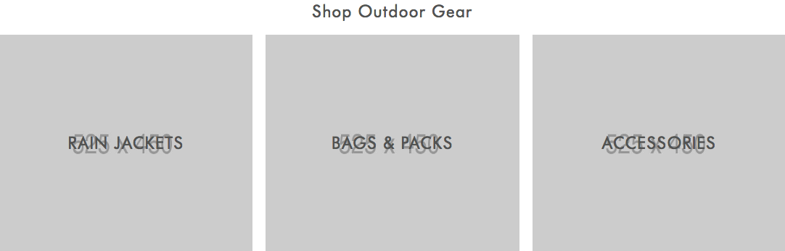

# Documentation - Macpac

## Introduction

### Our Approach to Responsive/Retina Imagery

Most browsers are capable of showing an optimised image depending on the device you are using. For example, if you are viewing a page on a Retina device - the browser is able to detect that and display the correct image accordingly. Similarly - if you are viewing on a smaller screen, the browser detects that and only downloads an image appropriate for that viewport. This is all in the aim of finding the perfect balance between browser performance and optimal image quality.

There is however a downside to this - from a Content Management point of view, this massively increases the effort in terms of managing images.

For example - its fairly common to have the following breakpoints in a design:

* 320px
* 768px
* 1024px
* 1366px

So to provide optimised responsive images at these breakpoints, you now have to produce 4 images at differing resolutions for every 1 images you see in the browser. This problem is further exacerbated should you decide to cater for Retina devices as well. Retina devices have twice the pixel density of normal screens which therefore introduces 4 more breakpoints to cater for:

* 640px
* 1536px
* 2048px
* 2732px

So, should all of these devices \(large to small sized screens as well as retina/non screens\) be catered for that means producing 8 images for every one image you see in browser - which is obviously not great from a content management perspective.

So as a compromise we opted to go for a '1.5x' approach - this approach means that instead of doubling the resolution of images served to retina screens, we times the resolution by 1.5 and serve that image to both retina and non-retina devices. We've also managed to reduce the number of necessary breakpoints down to 2, so you only have to manage 2 images for every 1 image you see in the browser \(one for mobile, and one for desktop\).

## Block 1 - Hero Image Slider


### Element Breakdown

#### 1\) Background Image

#### 2\) Sub-Heading \('Discover'\)

#### 3\) Main-Heading \('Macpac Alpine Series'\)

#### 4\) Copy

#### 5\) CTA

### Image Dimensions

You will need to produce two separate images per slide - this is because a different image is used in devices with small screens than larger desktop screens for the sake of performance as well as ensuring a sufficient level of quality across all devices - but especially retina capable devices.

| Desktop \(&gt;768px\) | Mobile \(&lt;768px\) |
| --- | --- |
| 2049w x 811w | 640w x 650h |


Images across different slides must be the same size otherwise their may be some strange behaviour from the slider.


### Modifying Content

#### 1\) Background Image

```markup
<!--Element 1 - Background Image-->
<picture>

      <!--The image shown for non-mobile, with a browser window width of over 768px-->
      <source media="(min-width: 768px)" srcset="https://placehold.it/2049x811.jpg"></source>

      <!--The image shown For mobile devices-->
      <source srcset="https://placehold.it/640x650.jpg"></source>

      <!-- Fallback img for browsers that dont support '<picture>' -->
      
  
</picture>
```

Locate both your Desktop and Mobile images. Replace both 'srcset' values with their respective image links - the first 'srcset' value needs to link to the desktop image and the second is the image displayed for mobile devices. 

The 'src' value in the &lt;img&gt; tag is a fallback, and will be displayed on browsers that don't support responsive imagery \(such as IE11\) - we recommend putting the desktop image here, and also don't forget to enter you alt text too.

#### 2\) Sub-heading

```markup
<!-- Element 2 - Sub Heading -->
<h2 class="slide-sub-title">Discover</h2>
```

Edit the text within the &lt;h2&gt; tag to modify - removing the text completely will hide the element if so desired.

#### 3\) Main-heading

```markup
<!-- Element 3 - Main-Heading -->
<h1 class="slide-title">Macpac Alpine Series</h1>
```

Edit the text within the &lt;h1&gt; tag to modify - removing the text completely will hide the element if so desired.

#### 4\) Copy

```markup
<!-- Element 4 - Copy -->
<p class="slide-content-body">Tested and refined on some of the world's harshest apline routes.</p>
```

Edit the text within the &lt;p&gt; tag to modify - removing the text completely will hide the element if so desired.

#### 5\) CTA

```markup
<!--Element 5 - CTA -->
<a href="#" class="button">Shop Now</a>
```

Edit the text within the &lt;a&gt; tag to modify - removing the text completely will hide the element if so desired - add finally, replace the 'href' value with the desired link destination.

### Managing Slides

You can add as many slides as you like to the Image Slider. Look for the &lt;div&gt; with a class of 'swiper-slide' - the slider interprets any div with this class to be a separate slide. So to add a slide all you need to do is copy this div \(and everything contained within it\) and paste directly below the closing &lt;/div&gt; of the div you just copied.

To remove a slide, simply do the opposite and remove the &lt;div&gt; mentioned above.


Look out for helper comments in the HTML - they are there to help you place the correct HTML in the correct place when it comes to adding or removing slides from your Slider.



If you only have one slide, the Slider will automatically turn into a Hero Image. This will disable any 'drag - momentum' from the slider, hide the pagination dots and remove the navigation arrows.


### Modifying Classes

You can add a number of classes to the parent &lt;div&gt; to modify how some elements are displayed, positioned or coloured. 

1. 'maxwidth' - This is enabled by default. Removing this will cause the block to stretch to 100% of the browsers width.
2. 'dark-text' - This is disabled by default. Adding this class will cause the blocks text to go to standard Macpac Black/Grey.

For example, having the following modifying classes will cause the block to not be fullwidth and have dark text.

```markup
<div class="static-content hero-slider dark-text maxwidth">
```

### HTML Snippet

```markup
<div class="static-content hero-slider dark-text show-border maxwidth">

        <!-- Slider main container -->

          <div class="swiper-container">

              <div class="swiper-wrapper">

                  <!-- Slides -->

                    <!--Slide 1 -->
                    <div class="swiper-slide swiper-no-swiping">

                        <div class="carousel-content-wrapper">

                          <!--image section-->
                          <div class="carousel-image-section">

                            <!--Element 1 - Background Image-->
                            <picture>
                                <!--The Image Shown for non-mobile, with a browser window width of over 768px-->
                                <source media="(min-width: 768px)" srcset="https://placehold.it/2049x811.jpg"></source>

                                <!--The image shown For mobile devices-->
                                <source srcset="https://placehold.it/640x650.jpg"></source>

                                <!-- Fallback img for browsers that dont support '<picture>' -->
                                

                            </picture>

                          </div>

                          <!--Content Section-->
                          <div class="carousel-text-section">

                            <div class="carousel-text-content">
                              <!-- Element 2 - Sub Heading -->
                              <h2 class="slide-sub-title">Discover</h2>
                              <!-- Element 3 - Main-Heading -->
                              <h1 class="slide-title">Macpac Alpine Series</h1>
                              <!-- Element 4 - Copy -->
                              <p class="slide-content-body">Tested and refined on some of the world's harshest apline routes.</p>

                              <div class="slide-content-cta button-container">

                              <!--Element 5 - CTA -->
                              <a href="#" class="button">Shop Now</a>

                              </div>

                            </div>

                          </div>

                        </div>

                  </div>

                  <!-- End Slide 1 -->

                  <!-- BEGIN ADDITIONAL SLIDES -->

                  <!-- END ADDITIONAL SLIDES -->

              </div>

              <div class="swiper-pagination"></div>

              <div class="swiper-button-next "></div>
              <div class="swiper-button-prev "></div>

          </div>

      </div>
```

## Block 2 - 50/50 Image Row


### Element Breakdown

1. Background Image
2. Large CTA
3. Heading
4. Copy
5. Inline CTA

### Image Dimensions

You will need to manage two images - one for desktop and one for mobile.

Both images in this block must be the same size to prevent unexpected block behaviour.

| Desktop \(&gt;768px\) | Mobile \(&lt;768px\) |
| --- | --- |
| 1024w x 648h | 576w x 250h |

### Modifying Content

#### 1\) Images

```markup
<picture>

  <!--The Image Shown for Portrait Tablets, with a browser window width of over 768px-->
  <source media="(min-width: 768px)" srcset="https://placehold.it/1024x648.jpg"></source>

  <!--The Image Shown For Smaller Portrait Mobile Devices-->
  <source srcset="https://placehold.it/576x250.jpg"></source>

  <!-- Fallback img for browsers that dont support '<picture>' -->
  

</picture>
```

Locate both your Desktop and Mobile images. Replace both 'srcset' values with their respective image links - the first 'srcset' value needs to link to the desktop image and the second is the image displayed for mobile devices. 

The 'src' value in the &lt;img&gt; tag is a fallback, and will be displayed on browsers that don't support responsive imagery \(such as IE11\) - we recommend putting the desktop image here, and also don't forget to enter you alt text too.

#### 2\) Large CTA

```markup
<!--Large CTA -->
<a href="#" class="button">Button Text</a>
```

Edit the text within the &lt;a&gt; tag, or remove it completely if you wish to hide the element. Replace the 'href' value with the desired link destination.

#### 3\) Text Section

```markup
<!--Text Section-->
<div class="tile-text-section">

      <h4>Heading</h4>

      <p>With over 40 years of pack building experience behind us, we've designed..</p>

      <a href="#" class="inline">Read More</a>

</div>
```

Edit the contents of the &lt;h4&gt;, &lt;p&gt; and &lt;a&gt; tags to alter content.


Note that unlike other blocks, removing the contents of these tags will not hide the element properly. To do that in this instance, use a modifying class instead.


### Modifying Classes

1. 'no-text-section' - disabled by default. This hides the Heading, Copy and Inline CTA should you wish to just have two images on their own.
2. 'maxwidth' - enabled by default. Removing this will cause the block to stretch to 100% of the windows width
3. 'dark-text' - enabled by default. Removing this will cause the Large CTA to change colour to white.

For example:

```markup
<div class="static-content half-split-image maxwidth no-text-section dark-text">
```

### HTML Snippet

```markup
<div class="static-content half-split-image show-border no-text-section dark-text maxwidth">

  <div class="tile-container">

    <!--Left Image-->

    <div class="tile-wrapper">

      <div class="tile-image-section">

        <picture>

            <!--The Image Shown for Portrait Tablets, with a browser window width of over 768px-->
            <source media="(min-width: 768px)" srcset="https://placehold.it/1024x648.jpg"></source>

            <!--The Image Shown For Smaller Portrait Mobile Devices-->
            <source srcset="https://placehold.it/442x465.jpg"></source>

            <!-- Fallback img for browsers that dont support '<picture>' -->
            

        </picture>

        <div class="image-text-overlay">

          <h3><!--Additional Heading can go here--></h3>

          <div class="button-container">

            <!--Large CTA -->
            <a href="#" class="button">Button Text</a>

          </div>

        </div>

      </div>

      <!--Text Section-->
      <div class="tile-text-section">

        <h4>Heading</h4>

        <p>With over 40 years of pack building experience behind us, we've designed..</p>

        <a href="#" class="inline">Read More</a>

      </div>

    </div>

    <!--Right Image-->

    <div class="tile-wrapper">

      <div class="tile-image-section">

        <picture>
            <!--The Image Shown for Portrait Tablets, with a browser window width of over 768px-->
            <source media="(min-width: 768px)" srcset="https://placehold.it/1024x648.jpg"></source>

            <!--The Image Shown For Smaller Portrait Mobile Devices-->
            <source srcset="https://placehold.it/576x250.jpg"></source>

            <!-- Fallback img for browsers that dont support '<picture>' -->
            

        </picture>

        <div class="image-text-overlay">

          <h3><!--Optional Heading Overlay Goes Here--></h3>

          <div class="button-container">

            <a href="#" class="button">Button Text</a>

          </div>

        </div>

      </div>

      <div class="tile-text-section">

        <h4>Heading</h4>

        <p>With over 40 years of pack building experience behind us, we've designed..</p>

        <a class="inline">Read More</a>

      </div>

    </div>

  </div>

</div>
```

## Block 3 - Masonry Block


### Element Breakdown

1. Block Heading
2. Feature Tile Image x1
3. Feature Tile Heading
4. Feature Tile Inline CTA
5. Small Tile Image x2
6. Small Tile Heading
7. Small Tile Inline CTA
8. Text Tile Heading
9. Text Tile Copy
10. Text Tile Inline CTA

### Image Dimensions

|  | Desktop \(&gt;768px\) | Mobile \(&lt;768px\) |
| --- | --- | --- |
| Feature Tile Image | 801w x 1006h | 592w x 738h |
| Small Tile Image | 801w x 489h | 592w x 360h |

### Modifying Content

This block consists of 3 images - one large image \(The Feature Tile Image\) and two small images. Each tile has a heading and an accompanying inline CTA.

A modifying class can be added to the two smaller tiles to change them into a 'Text Tile'. When this class is active - the image, heading and inline CTA is hidden and then replaced with a text section \(you can see this in the upper left most tile of the Desktop image above\).

#### 1\) Feature Image

```markup
<!-- Larger, Feature Image -->
<picture>

  <!--The Image shown for desktop screens above 768px-->
  <source media="(min-width: 768px)" srcset="https://placehold.it/801x1006.jpg"></source>

  <!--The Image Shown For Smaller Portrait Mobile Devices-->
  <source srcset="https://placehold.it/592x738.jpg"></source>

  <!-- Fallback img for browsers that dont support '<picture>' -->
  

</picture>
```

Replace both 'srcset' values with their respective image links - the first 'srcset' value needs to link to the desktop image and the second is the image displayed for mobile devices. 

The 'src' value in the &lt;img&gt; tag is a fallback, and will be displayed on browsers that don't support responsive imagery \(such as IE11\) - we recommend putting the desktop image here, and also don't forget to enter you alt text too.

#### 2\) Smaller Tile Image

```markup
<!--1st Small Tile Image-->
<picture>

  <source media="(min-width: 768px)" srcset="https://placehold.it/801x489.jpg"></source>

  <!--The Image Shown For Smaller Portrait Mobile Devices-->
  <source srcset="https://placehold.it/592x360.jpg"></source>

  <!-- Fallback img for browsers that dont support '<picture>' -->
  

</picture>
```

#### 3\) Feature Tile Heading and CTA

```markup
<!--Feature Tile Text Content-->
<div class="text-section align-right">

  <h3>Hiking & Treking</h3>

  <a href="#" class="inline">Shop Hiking Gear</a>

</div>

<a href="#" class="overlay-anchor"></a>
```

You can edit the content in between the &lt;h3&gt; and \(first\) &lt;a&gt; tags as normal. You can remove all text from those tags to hide those elements if desired.

When inputting the desired link destination, replace the 'href' value in the **second** a tag only \(the one with a class of "overlay-anchor"\) - the second &lt;a&gt; tag is invisible but makes the entire masonry title clickable to the desired link.

#### 4\) Text Tile Section

```markup
<!--Below is the content shown if the tile has the class is-text-tile-->
<div class="text-tile dark-text">

  <div class="tile-content-wrapper">

    <h3>Heading 3</h3>

    <p>All the best journeys start with a great backpack, and nobody makes packs like we do. With over 40 years of</p>

    <a href="#" class="inline"> Shop Now </a>

  </div>

</div>
```

This content can be edited fairly simply - just edit the content as normal and remember to replace the 'href' in the &lt;a&gt; with your desired link. 

#### 5\) Block Heading

```markup
<!--Masonry Block Heading-->
<h4 class="masonry-title">Whatever Your Adventure</h4>
```

### Modifying Classes

The following Classes should be applied to the outermost div.

```markup
<!--Outermost wrapper for masonry block-->
<div class="static-content masonry-block show-border feature-right dark-text">
```

1. 'feature-right' or 'feature-left' - applying this to the outermost div will determine whether the large Feature Tile floats to the left or the right.
2. 'dark-text' - if this is present, the &lt;h3&gt; and &lt;a&gt; overlaid over the tile images will turn from white to black/grey.
3. 'hide-heading' - this will hide the top heading and accompanying orange underline.


There should only ever be either 'feature-left' or 'feature-right' classes present - if both are present this could leave to unpredictable block behaviour.


The following Classes should be applied to the div wrapping the text overlaid on the masonry tile images.

```markup
<div class="text-section align-right">

  <h3>Hiking & Treking</h3>

  <a href="#" class="inline">Shop Hiking Gear</a>

</div>
```

1. 'align-left', 'align-right' or 'align-center' - applied to specific tiles respective text section will align the text to the left, right or centre of the tile in question.

### HTML Snippet

```markup
<div class="static-content masonry-block show-border feature-right dark-text">

  <!--Masonry Block Heading-->
  <h4 class="masonry-title">Whatever Your Adventure</h4>

  <div class="title-underline"></div>

  <div class="masonry-wrapper">

    <!--Begin Feature Column-->

    <div class="feature-column">

      <div class="content-section">

        <!-- Larger, Feature Image -->
        <picture>
          <!--The Image shown for desktop screens above 768px-->
          <source media="(min-width: 768px)" srcset="https://placehold.it/801x1006.jpg"></source>

          <!--The Image Shown For Smaller Portrait Mobile Devices-->
          <source srcset="https://placehold.it/592x738.jpg"></source>

          <!-- Fallback img for browsers that dont support '<picture>' -->
          

        </picture>

      </div>

      <!--Feature Tile Text Content-->
      <div class="text-section align-left">

        <h3>Hiking & Treking</h3>

        <a href="#" class="inline">Shop Hiking Gear</a>

      </div>

      <a href="#" class="overlay-anchor"></a>

    </div>

    <!--End Feature Section-->

    <!--Begin Second Section-->

    <div class="two-section-column">

      <div class="first-section">

        <!-- Add is-text-tile to div below for Text Tile State -->
        <div class="content-section is-text-tile">

          <!--1st Small Tile Image-->
          <picture>

            <source media="(min-width: 768px)" srcset="https://placehold.it/801x489.jpg"></source>

            <!--The Image Shown For Smaller Portrait Mobile Devices-->
            <source srcset="https://placehold.it/592x360.jpg"></source>

            <!-- Fallback img for browsers that dont support '<picture>' -->
            

          </picture>

          <div class="text-section align-right">

            <h3>Active Wear</h3>

            <a class="inline">Shop Now</a>

          </div>

          <!--Below is the content shown if the tile has the class is-text-tile-->
          <div class="text-tile dark-text">

            <div class="tile-content-wrapper">

              <h3>Heading 3</h3>

              <p> All the best journeys start with a great backpack, and nobody makes packs like we do. With over 40 years of</p>

              <a href="#" class="inline"> Shop Now </a>

            </div>

          </div>

          <a href="#" class="overlay-anchor"></a>

        </div>

      </div>

      <div class="second-section">

        <!-- Add is-text-tile to div below for Text Tile State -->
        <div class="content-section">

          <picture>

            <source media="(min-width: 768px)" srcset="https://placehold.it/801x489.jpg"></source>

            <!--The Image Shown For Smaller Portrait Mobile Devices-->
            <source srcset="https://placehold.it/592x360.jpg"></source>

            <!-- Fallback img for browsers that dont support '<picture>' -->
            

          </picture>

          <div class="text-section align-left">

            <h3>Active Wear</h3>

            <a class="inline">Shop Now</a>

          </div>

          <!--Below is the div show if the tile is-text-tile-->
          <div class="text-tile dark-text">

            <div class="tile-content-wrapper">

              <h3>Heading 3</h3>

              <p> All the best journeys start with a great backpack, and nobody makes packs like we do. With over 40 years of</p>

              <a class="inline"> Shop Now </a>

            </div>

          </div>

          <a href="#" class="overlay-anchor"></a>

        </div>

    </div>

    <!--End second section -->

  </div>

</div>

</div>
```

## Block 4 - 3 Image Row




### Element Breakdown

1. Block Heading
2. Background Image x3
3. Heading Overlay


### Image Dimensions

| Desktop \(&gt;768px\) | Mobile \(&lt;768px\) |
| --- | --- |
| 525w x 450h | 592w x 432h |

### Modifying Content

#### 1\) Background Image

```markup
<!--3 Image Image Block - Image 1 -->
<picture>

  <source media="(min-width: 768px)" srcset="https://placehold.it/525x450.jpg"></source>

  <!--The Image Shown For Smaller Portrait Mobile Devices-->
  <source srcset="https://placehold.it/592x432.jpg"></source>

  <!-- Fallback img for browsers that dont support '<picture>' -->
  

</picture>
```

Replace both 'srcset' values with their respective image links - the first 'srcset' value needs to link to the desktop image and the second is the image displayed for mobile devices. 

The 'src' value in the &lt;img&gt; tag is a fallback, and will be displayed on browsers that don't support responsive imagery \(such as IE11\) - we recommend putting the desktop image here, and also don't forget to enter you alt text too.

#### 2\) Heading Overlay

```markup
<!--Heading Overlay Section-->
<div class="text-overlay">

  <h4>Rain Jackets</h4>
        
</div>

<a href="#" class="overlay-anchor"></a>
```

The heading can be changed by editing the &lt;h4&gt; tag as normal, and the the link destination needs to be placed in the 'href' value.

### Modifying Classes

The following classes can be toggled on the outermost div.

1. 'maxwidth' - toggles whether the block stretches to the full width of the browser window
2. 'dark-text' - if present this changes the colour of the heading to black/grey.
3. 'no-heading' - if present, this hides the top heading above the 3 images.

```markup
<div class="static-content three-image-row maxwidth dark-text no-heading">
```

### HTML Snippet

```markup
<div class="static-content three-image-row show-border maxwidth dark-text">

  <h4 class="block-title">Shop Outdoor Gear</h4>

  <div class="three-image-wrapper">

    <div class="image-one">

      <!--3 Image Image Block - Image 1 -->
      <picture>

        <source media="(min-width: 768px)" srcset="https://placehold.it/525x450.jpg"></source>

        <!--The Image Shown For Smaller Portrait Mobile Devices-->
        <source srcset="https://placehold.it/592x432.jpg"></source>

        <!-- Fallback img for browsers that dont support '<picture>' -->
        

      </picture>
      <!--Heading Overlay Section-->
      <div class="text-overlay">
        <h4>Rain Jackets</h4>
      </div>

      <a href="#" class="overlay-anchor"></a>

    </div>

    <div class="image-two">

      <picture>

        <source media="(min-width: 768px)" srcset="https://placehold.it/525x450.jpg"></source>

        <!--The Image Shown For Smaller Portrait Mobile Devices-->
        <source srcset="https://placehold.it/592x432.jpg"></source>

        <!-- Fallback img for browsers that dont support '<picture>' -->
        

      </picture>

      <div class="text-overlay">
        <h4>Bags & Packs</h4>
      </div>

      <a href="#" class="overlay-anchor"></a>

    </div>

    <div class="image-three">

      <picture>

        <source media="(min-width: 768px)" srcset="https://placehold.it/525x450.jpg"></source>

        <!--The Image Shown For Smaller Portrait Mobile Devices-->
        <source srcset="https://placehold.it/592x432.jpg"></source>

        <!-- Fallback img for browsers that dont support '<picture>' -->
        

      </picture>

      <div class="text-overlay">

        <h4>Accessories</h4>

      </div>

      <a href="#" class="overlay-anchor"></a>

    </div>

  </div>

</div>
```

## Block 5 - 2/3 Image Row


### Element Breakdown

1. Feature Image
2. Copy & CTA's

### Image Dimensions

| Desktop \(&gt;768px\) | Mobile \(375px\) |
| --- | --- |
| 1366w x 930h | 592w x 410h |

### Modifying Content

#### 1\) Feature Image

```markup
<!--Feature Image-->
<picture>

   <source media="(min-width: 768px)" srcset="https://placehold.it/1366x930.jpg"></source>

   <!--The Image Shown For Smaller Portrait Mobile Devices-->
   <source srcset="https://placehold.it/592x410.jpg"></source>

   <!-- Fallback img for browsers that dont support '<picture>' -->
   

</picture>
```

Replace both 'srcset' values with their respective image links - the first 'srcset' value needs to link to the desktop image and the second is the image displayed for mobile devices. 

The 'src' value in the &lt;img&gt; tag is a fallback, and will be displayed on browsers that don't support responsive imagery \(such as IE11\) - we recommend putting the desktop image here, and also don't forget to enter you alt text too.

#### 2\) Copy & CTA's

```markup
<div class="content-items">

  <p> All the best journeys start with a greay backpack, and nobody makes packs like we do.</p>

  <a class="button" href="#">Shop Womens</a>

  <a class="button" href="#">Shop Mens</a>

  <a class="button" href="#">Shop Kids</a>

</div>
```

### Modifying Classes

1. 'maxwidth' - toggles whether the block stretches 100% of the browsers width.
2. 'dark-text' - Changes the text colour to dark grey / black.
3. 'image-right' / 'image-left' - switches the order of the image and text within the block.

### HTML Snippet

```markup
<div class="static-content two-thirds-block show-border maxwidth dark-text image-right">

  <div class="two-thirds-wrapper">

    <div class="image-wrapper">
      <!--Feature Image-->
      <picture>

        <source media="(min-width: 768px)" srcset="https://placehold.it/1366x930.jpg"></source>

        <!--The Image Shown For Smaller Portrait Mobile Devices-->
        <source srcset="https://placehold.it/592x410.jpg"></source>

        <!-- Fallback img for browsers that dont support '<picture>' -->
        

      </picture>

    </div>

    <div class="content-wrapper">

      <div class="content-items">

        <p> All the best journeys start with a greay backpack, and nobody makes packs like we do.</p>

        <a class="button" href="#">Shop Womens</a>

        <a class="button" href="#">Shop Mens</a>

        <a class="button" href="#">Shop Kids</a>

      </div>

    </div>

  </div>

</div>

```

## Block 6 - Text Block


### Element Breakdown

1. Block Heading
2. Copy
3. Inline CTA

### Modifying Content

```markup
<div class="static-content text-block">

  <div class="content-wrapper">

    <h4>Whatever Your Adventure</h4>

    <p> All the best journeys start with a great backpack, and nobody makes packs
      like we do. With over 40 years of pack building experience behind us, we've designed a range that caters to every adventure. </p>

    <a href="#" class="inline">Read More</a>

  </div>
```

### HTML Snippet

```markup
<div class="static-content text-block show-border maxwidth">

  <div class="content-wrapper">

    <h4>Whatever Your Adventure</h4>

    <p> All the best journeys start with a great backpack, and nobody makes packs
      like we do. With over 40 years of pack building experience behind us, we've designed a range that caters to every adventure.</p>

    <a href="#" class="inline">Read More</a>

  </div>

</div>
```

## Block 7 - 2 Column Row


### Element Breakdown

1. Background Image
2. Heading
3. Icons
4. Copy

### Image Dimensions

| Desktop \(&gt;768px\) | Mobile \(&lt;768px\) |
| --- | --- |
| 2049w x 823h | 592w x 792h |

### Modifying Content

#### 1\) Heading and Icons

```markup
<div class="column-contents">

            <!--Heading-->
            <h5>The legendary Halo Down Jacket</h5>

            <div class="icon-wrapper">
              <!--Icons-->
              
              
              

            </div>

</div>
```

The &lt;h5&gt; heading can be edited normally. To replace the icons, swap out the value of the 'src' attribute for the respective &lt;img&gt; tag. 

Removing the content of the &lt;h5&gt; and the linked images here will remove the elements entirely, resulting in one empty column on the left and one column of copy on the right.


Any new icons used here must be on an artboard of 40px x 40px.


#### 2\) Copy

```markup
        <!--Start of the copy section-->
        <div class="column-two">

          <p>The uber light range is designed to be functional and stylish in colder conditions. It's high quality down helps allow the jacket to be packed away into a seperate stuff sack for any on-the-go use. Ideal for urban adventure, travel, hiking and camping</p>

        </div>

```

### Modifying Classes

1. 'maxwidth' - Removing this will make the block stretch to 100% width
2. 'dark-text' - removing this will cause the text change to white in colour. \(Remember to change your icons in the &lt;img&gt; tags to match as well - by default these are dark icons.\)

```markup
<div class="static-content two-column-content-row maxwidth dark-text">
```

### HTML Snippet

```markup
<div class="static-content two-column-content-row show-border maxwidth dark-text">

  <div class="content-wrapper">

    <div class="image-wrapper">

      <picture>

        <source media="(min-width: 768px)" srcset="https://placehold.it/2049x823.jpg"></source>

        <!--The Image Shown For Smaller Portrait Mobile Devices-->
        <source srcset="https://placehold.it/592x792.jpg"></source>

        <!-- Fallback img for browsers that dont support '<picture>' -->
        

      </picture>

    </div>

    <div class="column-wrapper">

        <div class="column-one">

          <div class="column-contents">

            <!--Heading-->
            <h5>The legendary Halo Down Jacket</h5>

            <div class="icon-wrapper">

              <!--Icons-->
              
              
              

            </div>

          </div>

        </div>

        <!--Start of the copy section-->
        <div class="column-two">

          <p>The uber light range is designed to be functional and stylish in colder conditions. It's high quality down helps allow the jacket to be packed away into a seperate stuff sack for any on-the-go use. Ideal for urban adventure, travel, hiking and camping</p>

        </div>

    </div>

  </div>

</div>
```

